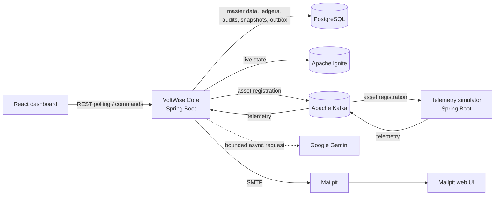
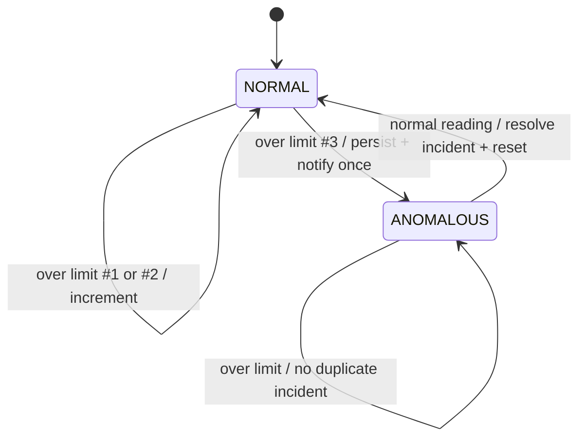

# VoltWise

VoltWise is a real-time household energy platform that registers homes and
appliances, simulates realistic appliance behavior, transports telemetry over
Kafka, maintains low-latency live state in Apache Ignite, and keeps permanent
billing and audit records in PostgreSQL. A responsive React dashboard exposes
live power, energy, cost, quota, tariff, anomaly, and historical information.

The system is designed to remain useful when external services are unavailable:
Gemini has bounded timeouts and a deterministic Turkish fallback, notification
work runs away from Kafka listener threads, and Mailpit captures development
email without delivering it to real recipients.

## Architecture



VoltWise Core is one modular application, not a set of microservices. The
simulator is separately deployable because its lifecycle and workload are
independent, and its only application-level integration with the Core is Kafka.

## End-to-end data flow

1. A client posts a home and one or more appliances to the Core REST API.
2. The Core validates and transactionally stores the master data in PostgreSQL.
3. The same transaction records an immutable registration event in a PostgreSQL
   outbox. A bounded dispatcher publishes it after commit, marks it delivered
   only after Kafka acknowledges it, and retries failures with capped backoff.
4. The simulator consumes that event and adds or replaces the assets in its
   in-memory registry idempotently.
5. On each configured interval, every registered appliance advances its own
   state machine and emits one telemetry event.
6. The Core consumes telemetry, rejects duplicate event IDs, calculates elapsed
   energy and cost, evaluates quota and anomaly rules, and atomically updates
   the live state in Ignite.
7. Durable ledger, quota, anomaly, tariff transition, recommendation, and
   notification records are written to PostgreSQL at their appropriate
   transaction boundaries.
8. A scheduled job atomically rotates Ignite interval accumulators and persists
   energy/cost deltas plus average and maximum power as historical snapshots.
9. The dashboard polls Ignite-backed status endpoints while reading historical
   series and audit data from PostgreSQL-backed endpoints.

## Components

| Component | Responsibility |
| --- | --- |
| `backend` | Registration API, master data, Kafka integration, live-state updates, billing, quota/anomaly transitions, snapshots, Gemini, email, OpenAPI |
| `telemetry-simulator` | Dynamic asset discovery and stateful, seeded, configurable appliance telemetry generation |
| `frontend` | Registration workflow, live dashboard and modal, historical charts, events and recommendations |
| `contracts` | Stable JSON Schema and examples shared by producers, consumers, and UI implementers |
| PostgreSQL | Permanent source of truth for master, financial, historical, and audit data |
| Apache Ignite | Volatile, rebuildable state optimized for frequent dashboard reads |
| Apache Kafka | Asynchronous registration and telemetry transport with retry/DLT paths |
| Mailpit | Safe local SMTP receiver and message inspection UI |

## Kafka topology and contracts

| Topic | Producer | Consumer | Purpose |
| --- | --- | --- | --- |
| `voltwise.asset-registration` | Core | simulator group | Discover newly registered homes and appliances |
| `voltwise.telemetry` | simulator | Core group | Deliver one evaluation cycle per appliance |
| `voltwise.asset-registration.dlt` | retry recoverer | operators | Asset messages that exhausted retries |
| `voltwise.telemetry.dlt` | retry recoverer | operators | Telemetry messages that exhausted retries |

All events include `eventId`, `eventVersion`, `eventType`, and `occurredAt`.
Timestamps are ISO-8601 UTC and enum values are uppercase canonical strings.
Schemas and representative payloads live in [`contracts`](contracts/README.md).
The registration topic is compacted so the simulator can rebuild its in-memory
registry after restarting; telemetry uses ordinary delete retention.

## Ignite versus PostgreSQL

| Data | Ignite | PostgreSQL |
| --- | ---: | ---: |
| Current home/appliance power and operating state | Yes | No |
| Current accumulated live energy/cost and breach counters | Yes | Durable aggregates in ledger/snapshots |
| Home/appliance master data | Rebuild seed only | Yes |
| Billing ledger and tariff transition audit | No | Yes |
| Quota and anomaly event history | Active state reflected | Yes |
| Historical chart snapshots | No | Yes |
| Recommendations and delivery attempts | No | Yes |

Ignite can be empty after a restart. The Core lazily seeds a live home from
PostgreSQL master and ledger data when registration or telemetry is processed;
therefore a cache loss does not delete permanent or financial records.

## Database schema

Flyway creates normalized tables for:

- `homes` and `appliances`: validated master data and safe limits;
- `billing_ledgers`: one versioned aggregate per home and UTC billing month;
- `processed_events`: event-ID idempotency records;
- `quota_events`: deduplicated 80% and 100% crossings per billing period;
- `anomaly_events`: detected and resolved appliance incidents;
- `tariff_change_events`: auditable normal-to-penalty changes and rates;
- `consumption_snapshots`: home and appliance time-bucket summaries;
- `recommendations`: Gemini output or deterministic fallback text;
- `notifications`: PENDING, SENT, or FAILED delivery attempts;
- `asset_registration_outbox`: transactionally captured registration payloads,
  attempt metadata, retry scheduling, and broker-acknowledged delivery state.

Foreign keys preserve home/appliance ownership and indexes cover the principal
home, appliance, time-range, billing-period, and notification-status queries.

## Business rules

### Energy and tariffs

Each accepted telemetry event contributes:

```text
energyDeltaKwh = powerWatts * elapsedSeconds / 3,600,000
```

Money uses decimal arithmetic. Consumption before a 100% budget crossing is
charged at `normalTariffPerKwh`. If one delta straddles the remaining budget,
the affordable portion is charged normally and only the rest is charged at
`normalTariffPerKwh * penaltyMultiplier`. Later deltas use the penalty rate.
Previous energy is never repriced. A transition is written once to the tariff
audit table.

Budget use is `currentCost / monthlyBudget * 100`. The 80% and 100% events have
period-and-threshold uniqueness constraints, so repeated telemetry cannot create
duplicate quota notifications.

### Anomaly cycle definition

One telemetry record for one appliance is one evaluation cycle:



`powerWatts > safePowerLimitWatts` increments the consecutive counter. Equality
is safe. Any safe reading immediately resets the counter. A third consecutive
breach moves `NORMAL` to `ANOMALOUS`; further unsafe readings update live state
without generating another incident. The first safe reading resolves the active
incident and sets `resolvedAt`.

## Stateful telemetry model

The simulator maintains state per appliance instead of drawing unrelated random
values. Dedicated generators model all supported types:

- refrigerators cycle among idle, compressor, and occasional startup load;
- kettles and microwaves run short high-power sessions and return to off;
- ovens heat strongly and then thermostat-cycle;
- televisions remain stable while on and otherwise use low standby power;
- washing machines move through fill, wash, heat, and spin-like phases;
- air conditioners alternate fan/standby and compressor cycles;
- lamps use stable rated-like power while on;
- computers transition among off, standby, idle, and high load.

`SIMULATION_RANDOM_SEED` makes runs repeatable. A low
`SIMULATION_ANOMALY_PROBABILITY` may begin a deliberately consecutive over-limit
sequence for demonstrations; it does not make every reading anomalous.

## Recommendations and email

Quota, anomaly, and tariff transitions enqueue notification work. The Gemini
client receives structured home, cost, budget, tariff, anomalous appliance,
reading, and safe-limit context and requests concise actionable Turkish advice.
API keys come only from `GEMINI_API_KEY`; connect/read timeouts are explicit.

If the key is absent, Gemini is rate-limited, the response is malformed, or a
request fails, VoltWise persists this deterministic Turkish fallback:

> Enerji kullanımınız tanımlanan sınıra ulaşmış veya bir cihazda olağan dışı tüketim algılanmıştır. Lütfen cihazlarınızı ve güncel tüketim değerlerinizi kontrol ediniz.

A notification row is persisted as `PENDING` before SMTP is attempted, then
becomes `SENT` or `FAILED` with a sanitized failure reason. In Compose, open
Mailpit at <http://localhost:8025> to inspect messages without real delivery.

## REST API

The versioned API is rooted at `/api/v1`:

- `POST /auth/register` creates an email/password account and returns a JWT;
- `POST /auth/login` validates credentials and returns a JWT;
- `POST /homes` registers a home with multiple appliances;
- `GET /homes?page=0&size=20` lists registered homes;
- `GET /homes/status?page=0&size=50` returns bounded live summaries;
- `GET /homes/{homeId}/status` returns home and appliance live details;
- `GET /homes/{homeId}/history?from=...&to=...&bucket=HOUR&page=0&size=100`
  returns PostgreSQL-backed HOUR or DAY buckets;
- `GET /homes/{homeId}/events?page=0&size=20` returns quota, tariff, and
  anomaly audit events;
- `GET /homes/{homeId}/recommendations?page=0&size=20` returns generated and
  fallback advice.

Swagger UI documents validation and examples and is available at
<http://localhost:8080/swagger-ui.html> after startup.

Register an account and use the returned token as
`Authorization: Bearer <token>` for home APIs:

```bash
curl -X POST http://localhost:8080/api/v1/auth/register \
  -H 'Content-Type: application/json' \
  -d '{"email":"owner@example.com","password":"securePassword"}'
```

Example home registration:

```bash
curl -X POST http://localhost:8080/api/v1/homes \
  -H 'Content-Type: application/json' \
  -H 'Authorization: Bearer <token>' \
  -d '{
    "name": "Kadikoy Home",
    "contactEmail": "owner@example.com",
    "monthlyBudget": 1000.00,
    "normalTariffPerKwh": 2.50,
    "penaltyMultiplier": 1.50,
    "appliances": [
      {
        "name": "Kitchen Kettle",
        "type": "KETTLE",
        "safePowerLimitWatts": 2200
      },
      {
        "name": "Living Room Lamp",
        "type": "LAMP",
        "safePowerLimitWatts": 80
      }
    ]
  }'
```

Validation failures use one error envelope with timestamp, HTTP status, safe
message, request path, and field-specific errors; server stack traces are never
included.

## Prerequisites

The supported path needs only:

- Docker Engine with Docker Compose v2 (Docker Desktop is sufficient);
- Git and `curl` for cloning and the smoke test.

For running services directly, install Java 21, Maven 3.9+, Node.js 22+ and npm
10+. The repository is developed and tested on newer compatible npm releases as
well.

## Configuration

Copy the safe template and change credentials before any non-local deployment:

```bash
cp .env.example .env
```

| Variable | Default/example | Purpose |
| --- | --- | --- |
| `POSTGRES_DB`, `POSTGRES_USER`, `POSTGRES_PASSWORD` | local values in template | Database bootstrap credentials |
| `SPRING_DATASOURCE_URL` | `jdbc:postgresql://postgres:5432/voltwise` | Core JDBC URL |
| `JWT_SECRET`, `JWT_EXPIRATION_SECONDS` | local secret, `86400` | JWT signing secret and lifetime |
| `KAFKA_BOOTSTRAP_SERVERS` | `kafka:29092` | Internal broker address |
| `IGNITE_ADDRESSES` | `ignite:10800` | Ignite thin-client addresses |
| `REGISTRATION_OUTBOX_*` | retry `5000`, batch `50`, ack `35000` | Durable registration retry cadence, bounds, and backoff |
| `GEMINI_API_KEY` | blank | Optional secret; blank selects fallback |
| `GEMINI_MODEL` | `gemini-2.0-flash` | Configurable model identifier |
| `GEMINI_CONNECT_TIMEOUT_MS`, `GEMINI_READ_TIMEOUT_MS` | `3000`, `7000` | External-call bounds |
| `MAIL_HOST`, `MAIL_PORT` | `mailpit`, `1025` | SMTP endpoint |
| `MAIL_USERNAME`, `MAIL_PASSWORD`, `MAIL_FROM` | blank / local sender | SMTP authentication and sender |
| `MAIL_CONNECT_TIMEOUT_MS`, `MAIL_READ_TIMEOUT_MS`, `MAIL_WRITE_TIMEOUT_MS` | `3000`, `5000`, `5000` | SMTP operation bounds |
| `TELEMETRY_INTERVAL_MS` | `1000` | Simulator scheduling interval |
| `SNAPSHOT_INTERVAL_MS` | `60000` | Durable snapshot interval |
| `SIMULATION_RANDOM_SEED` | `20260721` | Repeatable PRNG seed |
| `SIMULATION_ANOMALY_PROBABILITY` | `0.02` | Chance to begin a demo breach sequence |
| `SIMULATION_ANOMALY_DEMO_ENABLED`, `SIMULATION_ANOMALY_DEMO_APPLIANCE_IDS` | `false`, blank | Optional deterministic demo targeting |
| `DEFAULT_MONTHLY_BUDGET` | `1000.00` | Registration fallback budget |
| `NORMAL_TARIFF_PER_KWH` | `2.50` | Registration fallback normal rate |
| `PENALTY_TARIFF_MULTIPLIER` | `1.50` | Registration fallback multiplier |
| `VITE_API_BASE_URL` | `/api/v1` | Browser API root through nginx |

Host port variables in `.env.example` let multiple stacks coexist. `.env` is
ignored by Git. Never put real credentials into the template or tracked YAML.

## Run with Docker Compose

From a clean clone:

```bash
cp .env.example .env
docker compose config
docker compose up --build
```

Compose starts PostgreSQL, a single-node Kafka KRaft broker, topic initializer,
Ignite, Mailpit, Core, simulator, and frontend. Health-based dependencies keep
applications from racing infrastructure initialization. PostgreSQL data is kept
in the named `postgres-data` volume.

URLs:

- Dashboard: <http://localhost:3000>
- Core health: <http://localhost:8080/actuator/health>
- Swagger UI: <http://localhost:8080/swagger-ui.html>
- OpenAPI JSON: <http://localhost:8080/v3/api-docs>
- Mailpit UI: <http://localhost:8025>

Stop containers without deleting history:

```bash
docker compose down
```

Deleting the named database volume is intentionally not part of normal setup or
troubleshooting because it removes permanent local records.

## Run services directly

Start only the infrastructure first:

```bash
docker compose up -d postgres kafka kafka-init ignite mailpit
```

Use local addresses in separate terminals:

```bash
cd backend
SPRING_DATASOURCE_URL=jdbc:postgresql://localhost:5432/voltwise \
SPRING_DATASOURCE_USERNAME=voltwise \
SPRING_DATASOURCE_PASSWORD=change-me-for-non-local-use \
KAFKA_BOOTSTRAP_SERVERS=localhost:9092 \
IGNITE_ADDRESSES=localhost:10800 \
MAIL_HOST=localhost mvn spring-boot:run
```

```bash
cd telemetry-simulator
KAFKA_BOOTSTRAP_SERVERS=localhost:9092 mvn spring-boot:run
```

```bash
cd frontend
npm ci
VITE_API_BASE_URL=/api/v1 npm run dev
```

## Tests

Run every component suite and production frontend build:

```bash
cd backend && mvn test
cd telemetry-simulator && mvn test
cd frontend && npm ci && npm run test -- --run && npm run build
```

Validate infrastructure interpolation and service structure:

```bash
docker compose config --quiet
```

When the complete stack is healthy, execute the end-to-end check:

```bash
./scripts/smoke-test.sh
```

The script waits for health, OpenAPI and frontend responses, registers a unique
home, extracts its ID, and waits for the simulator-to-Kafka-to-Core live status
round trip.

## Troubleshooting

**A configured host port is already in use.** Change its corresponding
`*_HOST_PORT` value in `.env`, then rerun `docker compose up --build`.

**The dashboard is up but shows a network error.** When using Compose, keep
`VITE_API_BASE_URL=/api/v1`; nginx proxies it to Core. When using Vite directly,
keep `/api/v1`; the checked-in Vite configuration proxies `/api` to the Core.

**A new home has no live values yet.** The simulator discovers registrations
asynchronously. Allow at least two telemetry intervals, then inspect
`docker compose logs telemetry-simulator backend kafka`.

**Gemini is not called.** A blank key intentionally selects the fallback. Set
`GEMINI_API_KEY` only in ignored `.env`, recreate `backend`, and inspect its
structured logs. Invalid or limited keys also fall back by design.

**No email appears in Mailpit.** Notifications occur only on a quota, tariff, or
anomaly transition. For a demo, use a very small monthly budget or a higher
simulation anomaly probability and wait for three consecutive unsafe cycles.

**History is initially empty.** Snapshots are periodic and empty windows are
skipped. Wait for both telemetry and `SNAPSHOT_INTERVAL_MS`, or lower the latter
in `.env` for a demonstration.

## Design decisions

- Kafka decouples asset registration and telemetry while retaining one modular
  Core and one autonomous simulator.
- PostgreSQL is authoritative; Ignite is deliberately disposable and optimized
  for frequent live reads.
- Event IDs plus database constraints provide practical idempotency under
  at-least-once Kafka delivery.
- A transactional outbox closes the database/Kafka dual-write gap for asset
  registration; the simulator handles a retried event idempotently.
- Snapshot windows are atomically rotated in Ignite. A failed database write
  merges the captured metrics back into the live window instead of dropping
  the interval.
- Quota and anomaly rules are explicit state transitions with persisted
  deduplication, rather than controller conditionals.
- Decimal prorating at a threshold prevents retroactive penalty pricing.
- External AI and SMTP are isolated behind interfaces to keep fallback behavior
  deterministic and unit-testable.
- The frontend uses abortable polling and preserves modal/chart state across
  updates instead of replacing the page.

## Known limitations

- Compose is a single-node development topology; production needs replicated
  Kafka/PostgreSQL/Ignite, TLS, authentication, metrics, and backups.
- Authentication and household authorization are outside this assignment; do
  not expose the development deployment to an untrusted network.
- Simulator runtime state is intentionally in memory. Its default unique
  consumer group replays the compacted registration topic after restart, then
  begins new appliance state machines. Run one simulator instance unless a
  deliberate shared-group/state strategy is introduced.
- Snapshot precision is bounded by the configured interval and should not be
  treated as utility-grade metering. Cross-window history averages are weighted
  by interval duration because persisted rows intentionally omit raw samples;
  a maximum that crosses a bucket boundary is conservatively represented in
  each touched bucket.
- Email delivery status records the SMTP handoff, not recipient inbox receipt.

## Team collaboration

| Contributor | Area | Notes |
| --- | --- | --- |
| Contributor 1 | Core/backend | _Add name and ownership_ |
| Contributor 2 | Simulator/contracts | _Add name and ownership_ |
| Contributor 3 | Frontend/operations | _Add name and ownership_ |

Before opening a pull request, follow [`AGENTS.md`](AGENTS.md), run all suites,
validate Compose, confirm no confidential PDF or `.env` is tracked, and describe
any externally blocked verification honestly.
