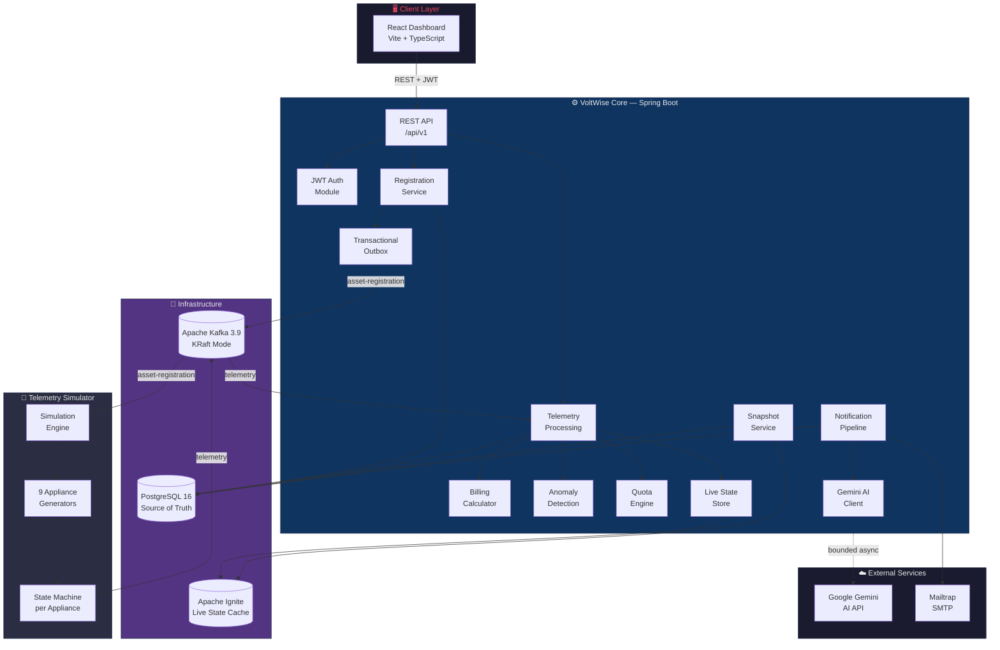
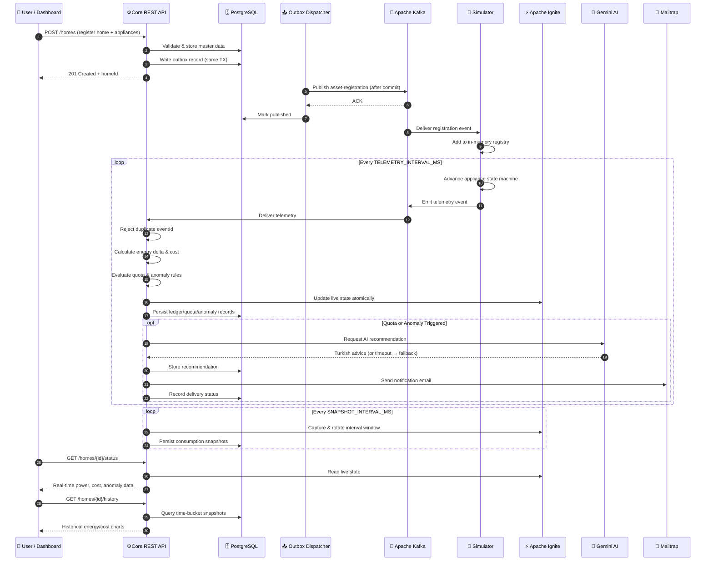
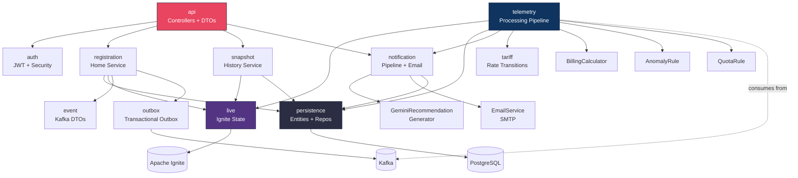
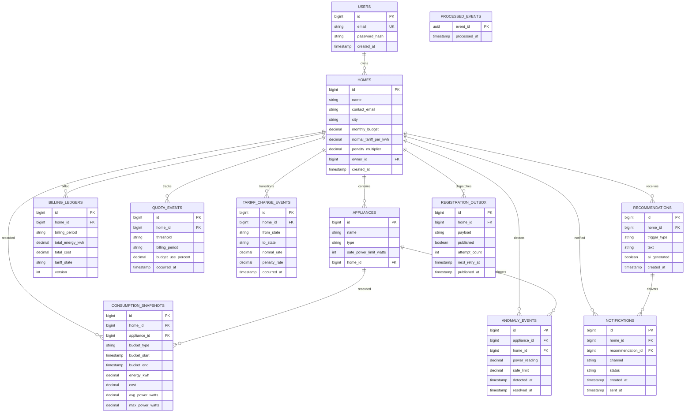
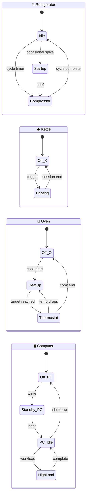
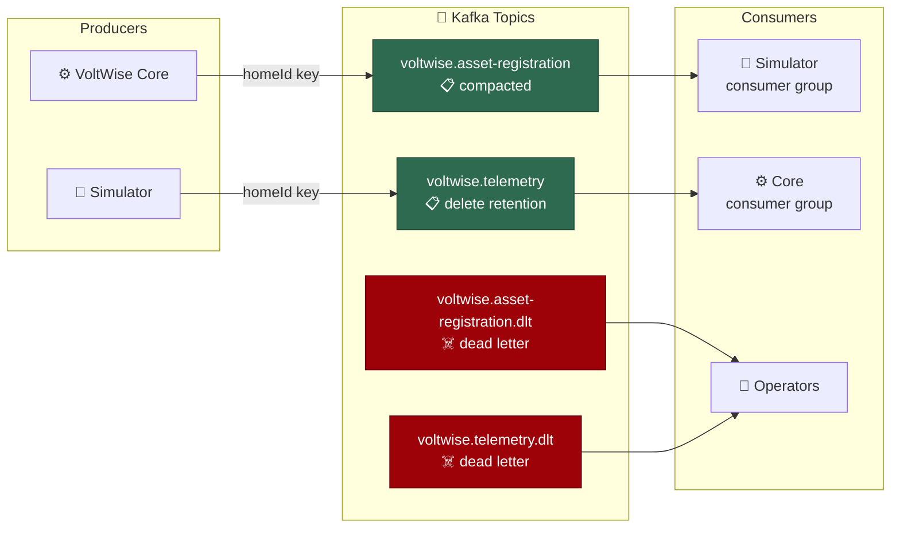
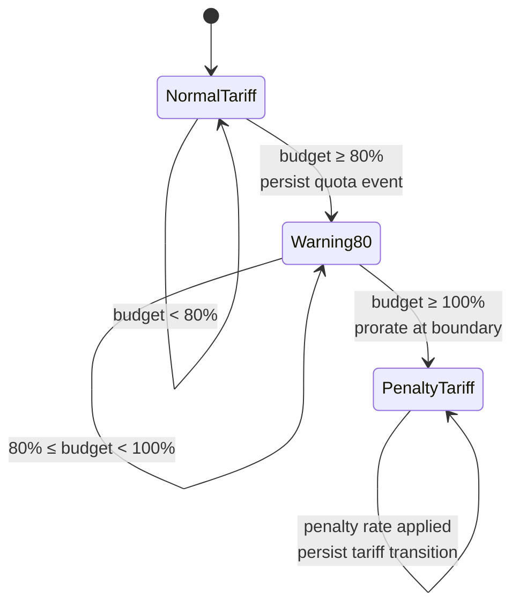
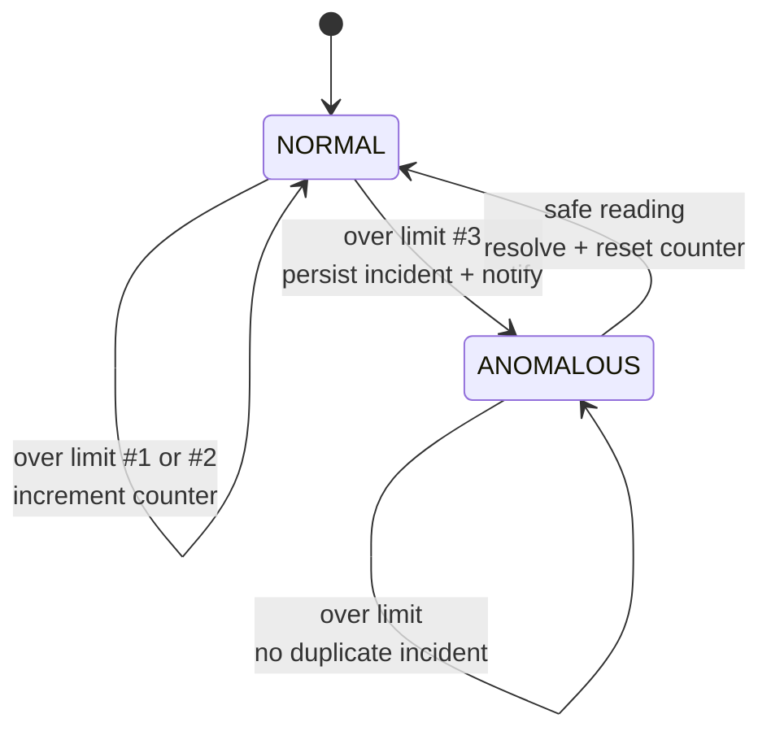
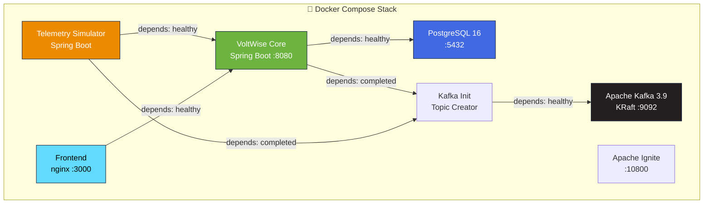

<p align="center">
  
  
  
  
  
  
  
  
</p>

# ⚡ VoltWise — Real-Time Household Energy Intelligence Platform

> **VoltWise** is a full-stack, event-driven smart home energy management platform that registers homes and appliances, simulates realistic appliance behavior, transports telemetry over Apache Kafka, maintains low-latency live state in Apache Ignite, and keeps permanent billing and audit records in PostgreSQL. A responsive React dashboard exposes live power, energy, cost, quota, tariff, anomaly, and historical information — all in real-time.

The system is designed to remain useful when external services are unavailable: Gemini AI has bounded timeouts and a deterministic Turkish fallback, and notification work runs away from Kafka listener threads.

---

## 📑 Table of Contents

- [Architecture Overview](#-architecture-overview)
- [System Architecture Diagram](#-system-architecture-diagram)
- [End-to-End Data Flow](#-end-to-end-data-flow)
- [Tech Stack](#-tech-stack)
- [Project Structure](#-project-structure)
- [Backend Deep Dive](#-backend-deep-dive)
- [Telemetry Simulator](#-telemetry-simulator)
- [Frontend Dashboard](#-frontend-dashboard)
- [Kafka Topology & Contracts](#-kafka-topology--contracts)
- [Database Schema](#-database-schema)
- [Business Rules](#-business-rules)
- [REST API Reference](#-rest-api-reference)
- [Getting Started](#-getting-started)
- [Configuration Reference](#-configuration-reference)
- [Testing](#-testing)
- [Troubleshooting](#-troubleshooting)
- [Design Decisions](#-design-decisions)
- [Known Limitations](#-known-limitations)
- [Contributing](#-contributing)
- [Team](#-team)

---

## 🏗 Architecture Overview

VoltWise follows a **modular monolith + autonomous simulator** architecture, connected via event-driven messaging:



VoltWise Core is one modular application, not a set of microservices. The simulator is separately deployable because its lifecycle and workload are independent, and its only application-level integration with the Core is Kafka.

---

## 🔄 End-to-End Data Flow



---

## 🛠 Tech Stack

### Backend
| Technology | Version | Purpose |
|---|---|---|
| **Java** | 21 | Core language |
| **Spring Boot** | 3.4.5 | Application framework |
| **Spring Kafka** | — | Kafka producer/consumer |
| **Spring Data JPA** | — | PostgreSQL ORM |
| **Spring Security Crypto** | — | Password hashing (BCrypt) |
| **Spring Mail** | — | SMTP email delivery |
| **Flyway** | — | Database migrations |
| **Apache Ignite** | 2.17.0 | Live state thin client |
| **SpringDoc OpenAPI** | 2.8.8 | Swagger UI & API docs |
| **Lombok** | — | Boilerplate reduction |
| **H2** | — | In-memory test database |

### Frontend
| Technology | Version | Purpose |
|---|---|---|
| **React** | 18.3 | UI framework |
| **TypeScript** | 5.6 | Type safety |
| **Vite** | 8.1 | Build tool & dev server |
| **Recharts** | 3.10 | Interactive charts |
| **Lucide React** | 0.468 | Icon library |
| **Manrope** | Variable | Typography |
| **Vitest** | 4.1 | Unit testing |

### Infrastructure
| Technology | Version | Purpose |
|---|---|---|
| **PostgreSQL** | 16.9 Alpine | Persistent data store |
| **Apache Kafka** | 3.9.1 (KRaft) | Event streaming |
| **Apache Ignite** | Latest | In-memory live state |
| **Docker Compose** | v2 | Container orchestration |
| **nginx** | — | Frontend reverse proxy |

### External Services
| Service | Purpose |
|---|---|
| **Google Gemini AI** | Smart energy recommendations (Turkish) |
| **Mailtrap** | Email notification delivery |

---

## 📁 Project Structure

```
voltwise/
├── 📂 backend/                          # VoltWise Core — Spring Boot
│   ├── 📂 src/main/java/com/voltwise/core/
│   │   ├── 📂 api/                      # REST controllers, DTOs, exception handling
│   │   │   ├── HomeController.java      # Home & appliance CRUD + status endpoints
│   │   │   ├── ChatController.java      # AI chat endpoint
│   │   │   ├── HomeDtos.java            # Request/response DTOs
│   │   │   └── GlobalExceptionHandler.java
│   │   ├── 📂 auth/                     # JWT authentication
│   │   │   ├── AuthController.java      # Login & register endpoints
│   │   │   ├── AuthService.java         # User management + JWT
│   │   │   ├── JwtTokenProvider.java    # Token generation & validation
│   │   │   └── AuthHeaderFilter.java    # Request filter
│   │   ├── 📂 config/                   # Application configuration
│   │   │   ├── KafkaConfig.java         # Kafka consumer/producer setup
│   │   │   ├── AsyncConfig.java         # Async thread pool
│   │   │   ├── OpenApiConfig.java       # Swagger/OpenAPI config
│   │   │   └── VoltWiseProperties.java  # Typed configuration properties
│   │   ├── 📂 domain/                   # Enums & value objects
│   │   │   ├── ApplianceType.java       # 9 supported appliance types
│   │   │   ├── OperatingState.java      # OFF, STANDBY, ON, HIGH_LOAD
│   │   │   ├── TariffState.java         # NORMAL, PENALTY
│   │   │   └── ...                      # QuotaThreshold, NotificationStatus, etc.
│   │   ├── 📂 event/                    # Kafka event DTOs
│   │   ├── 📂 live/                     # Ignite live state management
│   │   │   ├── HomeLiveState.java       # Home-level live aggregates
│   │   │   ├── ApplianceLiveState.java  # Appliance-level live state
│   │   │   ├── IgniteLiveStateStore.java
│   │   │   ├── InMemoryLiveStateStore.java
│   │   │   └── LiveStateInitializer.java
│   │   ├── 📂 notification/            # AI recommendations & email
│   │   │   ├── NotificationPipeline.java
│   │   │   ├── GeminiRecommendationGenerator.java
│   │   │   ├── EmailService.java
│   │   │   └── MailtrapController.java
│   │   ├── 📂 persistence/             # JPA entities & repositories
│   │   │   ├── 📂 entity/              # 13 JPA entities
│   │   │   └── 📂 repository/          # 12 Spring Data repositories
│   │   ├── 📂 registration/            # Home registration + outbox
│   │   │   ├── HomeService.java         # Core registration logic
│   │   │   ├── KafkaRegistrationPublisher.java
│   │   │   └── 📂 outbox/              # Transactional outbox pattern
│   │   ├── 📂 snapshot/                # Historical data capture
│   │   │   ├── SnapshotService.java     # Interval rotation
│   │   │   ├── SnapshotWriter.java      # PostgreSQL persistence
│   │   │   └── HistoryService.java      # Query API
│   │   ├── 📂 tariff/                  # Tariff transition logic
│   │   └── 📂 telemetry/              # Telemetry processing pipeline
│   │       ├── TelemetryProcessingService.java  # Main orchestrator
│   │       ├── BillingCalculator.java   # Decimal energy/cost math
│   │       ├── EnergyCalculator.java    # Delta calculations
│   │       ├── AnomalyRule.java         # 3-strike anomaly detection
│   │       └── QuotaRule.java           # 80%/100% budget tracking
│   └── 📂 src/main/resources/
│       ├── application.yml              # Main configuration
│       └── 📂 db/migration/            # 5 Flyway migrations
│
├── 📂 telemetry-simulator/             # Autonomous telemetry generator
│   └── 📂 src/main/java/com/voltwise/simulator/
│       ├── 📂 generator/               # 9 type-specific generators
│       │   ├── RefrigeratorTelemetryGenerator.java
│       │   ├── KettleTelemetryGenerator.java
│       │   ├── OvenTelemetryGenerator.java
│       │   ├── WashingMachineTelemetryGenerator.java
│       │   ├── AirConditionerTelemetryGenerator.java
│       │   ├── TelevisionTelemetryGenerator.java
│       │   ├── MicrowaveTelemetryGenerator.java
│       │   ├── LampTelemetryGenerator.java
│       │   ├── ComputerTelemetryGenerator.java
│       │   └── ApplianceSimulationState.java   # Per-appliance state machine
│       ├── 📂 kafka/                    # Kafka consumer & producer
│       ├── 📂 runtime/                  # Scheduling & lifecycle
│       └── 📂 service/                  # Simulation orchestration
│
├── 📂 frontend/                         # React + Vite + TypeScript
│   └── 📂 src/
│       ├── 📂 components/
│       │   ├── LandingPage.tsx           # Marketing landing page
│       │   ├── LoginPage.tsx             # Authentication UI
│       │   ├── RegistrationModal.tsx     # Home + appliance registration
│       │   ├── HomeCard.tsx              # Dashboard home card
│       │   ├── HomeDetailModal.tsx       # Detailed home view
│       │   ├── EnergyCharts.tsx          # Recharts-powered analytics
│       │   ├── Header.tsx                # Navigation header
│       │   ├── OverviewStats.tsx         # Dashboard statistics
│       │   ├── ChatWidget.tsx            # AI chat interface
│       │   ├── ProfileModal.tsx          # User profile
│       │   ├── MailtrapInboxModal.tsx    # In-app email viewer
│       │   ├── ApplianceCharacter.tsx    # Animated appliance icons
│       │   └── 📂 home-detail/          # Detail sub-components
│       ├── 📂 api/                       # API client (fetch + JWT)
│       ├── 📂 styles/                    # CSS modules
│       └── 📂 characters/               # Animated character components
│
├── 📂 contracts/                        # Technology-neutral API contracts
│   ├── 📂 schemas/                      # JSON Schema Draft 2020-12
│   ├── 📂 examples/                     # Sample payloads
│   └── README.md                        # Contract documentation
│
├── 📂 scripts/                          # Operational scripts
│   ├── smoke-test.sh                    # End-to-end integration test
│   ├── secret-scan.sh                   # Credential leak scanner
│   └── verify.sh                        # Pre-push verification
│
├── docker-compose.yml                   # Full stack orchestration
├── .env.example                         # Configuration template
├── AGENTS.md                            # Contributor guide & conventions
└── .gitignore
```

---

## ⚙️ Backend Deep Dive

### Module Dependency Graph



### JPA Entity Model



---

## 🔌 Telemetry Simulator

The simulator maintains **stateful per-appliance simulation** instead of drawing unrelated random values. Each of the 9 supported appliance types has a dedicated generator:



| Appliance | Behavior |
|---|---|
| 🧊 **Refrigerator** | Cycles among idle, compressor, and occasional startup load |
| 🫖 **Kettle** | Short high-power sessions, returns to off |
| 🍳 **Oven** | Heats strongly then thermostat-cycles |
| 📺 **Television** | Stable power while on, low standby |
| 🧺 **Washing Machine** | Multi-phase: fill → wash → heat → spin |
| ❄️ **Air Conditioner** | Alternates fan/standby and compressor cycles |
| 🔬 **Microwave** | Short high-power bursts, returns to off |
| 💡 **Lamp** | Stable rated power while on |
| 🖥️ **Computer** | Transitions: off → standby → idle → high load |

`SIMULATION_RANDOM_SEED` makes runs **repeatable**. A low `SIMULATION_ANOMALY_PROBABILITY` may begin a deliberately consecutive over-limit sequence for demonstrations.

---

## 🖥️ Frontend Dashboard

The React dashboard provides a **glassmorphism-styled** responsive UI:

| Component | Purpose |
|---|---|
| `LandingPage` | Marketing page with feature highlights |
| `LoginPage` | JWT-based authentication (login + register) |
| `RegistrationModal` | Multi-appliance home registration wizard |
| `HomeCard` | Live status card per home on dashboard |
| `HomeDetailModal` | Deep-dive: power, cost, anomaly, tariff details |
| `EnergyCharts` | Interactive Recharts: energy, cost, power over time |
| `ChatWidget` | AI-powered energy advisor chat |
| `MailtrapInboxModal` | In-app email notification viewer |
| `ProfileModal` | User profile management |
| `ApplianceCharacter` | Animated appliance status icons |
| `OverviewStats` | Aggregate dashboard statistics |
| `CreatedByCapsule` | Team attribution capsule |

---

## 📨 Kafka Topology & Contracts



### Event Envelope

Every Kafka event contains:

```json
{
  "eventId": "550e8400-e29b-41d4-a716-446655440000",
  "eventVersion": 1,
  "eventType": "ASSET_REGISTRATION | TELEMETRY",
  "occurredAt": "2026-07-21T12:00:01Z",
  "...payload fields..."
}
```

### Ignite vs PostgreSQL Data Ownership

| Data | Ignite | PostgreSQL |
|---|:---:|:---:|
| Current power & operating state | ✅ | ❌ |
| Live accumulated energy/cost | ✅ | Durable aggregates |
| Home/appliance master data | Rebuild seed | ✅ |
| Billing ledger & tariff audit | ❌ | ✅ |
| Quota/anomaly event history | Active state | ✅ |
| Historical chart snapshots | ❌ | ✅ |
| Recommendations & notifications | ❌ | ✅ |

> 💡 Ignite can be empty after a restart. The Core lazily seeds live state from PostgreSQL when registration or telemetry is processed.

---

## 📊 Database Schema

Flyway manages **5 versioned migrations**:

| Migration | Description |
|---|---|
| `V1__create_voltwise_schema.sql` | Core tables: homes, appliances, billing, quota, anomaly, tariff, snapshots, recommendations, notifications |
| `V2__add_asset_registration_outbox.sql` | Transactional outbox for Kafka reliability |
| `V3__add_city_to_homes.sql` | City field for home addresses |
| `V4__add_application_users.sql` | User accounts table for JWT auth |
| `V5__add_home_owner_email.sql` | Owner email on home entity |

---

## 📐 Business Rules

### Energy & Tariff Calculation

```
energyDeltaKwh = powerWatts × elapsedSeconds / 3,600,000
```

Money uses **BigDecimal** arithmetic. Consumption before a 100% budget crossing is charged at `normalTariffPerKwh`. If one delta straddles the remaining budget, the affordable portion is charged normally and only the rest is charged at the penalty rate. Previous energy is **never repriced**.



### Anomaly Detection — 3-Strike Rule



`powerWatts > safePowerLimitWatts` increments the consecutive counter. Equality is safe. Any safe reading immediately resets the counter. The third consecutive breach moves `NORMAL → ANOMALOUS`. The first safe reading resolves the active incident.

---

## 🌐 REST API Reference

Base URL: `/api/v1`

### Authentication

| Method | Endpoint | Description |
|---|---|---|
| `POST` | `/auth/register` | Create account, returns JWT |
| `POST` | `/auth/login` | Validate credentials, returns JWT |

### Homes & Appliances

| Method | Endpoint | Description |
|---|---|---|
| `POST` | `/homes` | Register home with appliances |
| `GET` | `/homes?page=0&size=20` | List registered homes |
| `GET` | `/homes/status?page=0&size=50` | Live status summaries |
| `GET` | `/homes/{id}/status` | Detailed home + appliance live state |
| `GET` | `/homes/{id}/history?from=&to=&bucket=HOUR` | Historical snapshots (HOUR/DAY) |
| `GET` | `/homes/{id}/events?page=0&size=20` | Quota, tariff, anomaly events |
| `GET` | `/homes/{id}/recommendations?page=0&size=20` | AI-generated advice |

### Quick Start Example

```bash
# 1. Register an account
curl -X POST http://localhost:8080/api/v1/auth/register \
  -H 'Content-Type: application/json' \
  -d '{"email":"owner@example.com","password":"securePassword"}'

# 2. Register a home (use the JWT token from step 1)
curl -X POST http://localhost:8080/api/v1/homes \
  -H 'Content-Type: application/json' \
  -H 'Authorization: Bearer <token>' \
  -d '{
    "name": "Kadikoy Home",
    "contactEmail": "owner@example.com",
    "monthlyBudget": 1000.00,
    "normalTariffPerKwh": 2.50,
    "penaltyMultiplier": 1.50,
    "appliances": [
      {"name": "Kitchen Kettle", "type": "KETTLE", "safePowerLimitWatts": 2200},
      {"name": "Living Room Lamp", "type": "LAMP", "safePowerLimitWatts": 80}
    ]
  }'
```

📖 **Full API docs:** http://localhost:8080/swagger-ui.html after startup.

---

## 🚀 Getting Started

### Prerequisites

| Requirement | Version |
|---|---|
| Docker Engine + Compose v2 | Latest (Docker Desktop works) |
| Git | Any |
| curl | For smoke test |

For direct development: Java 21, Maven 3.9+, Node.js 22+, npm 10+.

### One-Command Setup

```bash
# Clone the repository
git clone https://github.com/dkivrak/i2i-Systems-VoltFlow.git
cd i2i-Systems-VoltFlow

# Copy environment template
cp .env.example .env

# Validate and start the full stack
docker compose config
docker compose up --build
```

### Service URLs

| Service | URL |
|---|---|
| 🖥️ **Dashboard** | http://localhost:3000 |
| ⚙️ **Core Health** | http://localhost:8080/actuator/health |
| 📖 **Swagger UI** | http://localhost:8080/swagger-ui.html |
| 📋 **OpenAPI JSON** | http://localhost:8080/v3/api-docs |

### Docker Compose Services



### Run Services Directly (Development)

```bash
# Start only infrastructure
docker compose up -d postgres kafka kafka-init ignite

# Terminal 1 — Backend
cd backend
SPRING_DATASOURCE_URL=jdbc:postgresql://localhost:5432/voltwise \
SPRING_DATASOURCE_USERNAME=voltwise \
SPRING_DATASOURCE_PASSWORD=change-me-for-non-local-use \
KAFKA_BOOTSTRAP_SERVERS=localhost:9092 \
IGNITE_ADDRESSES=localhost:10800 mvn spring-boot:run

# Terminal 2 — Simulator
cd telemetry-simulator
KAFKA_BOOTSTRAP_SERVERS=localhost:9092 mvn spring-boot:run

# Terminal 3 — Frontend
cd frontend
npm ci
VITE_API_BASE_URL=/api/v1 npm run dev
```

---

## ⚙ Configuration Reference

Copy `.env.example` to `.env` before starting. **Never commit real credentials.**

| Variable | Default | Purpose |
|---|---|---|
| `POSTGRES_DB` | `voltwise` | Database name |
| `POSTGRES_USER` | `voltwise` | Database username |
| `POSTGRES_PASSWORD` | `change-me-for-non-local-use` | Database password |
| `SPRING_DATASOURCE_URL` | `jdbc:postgresql://postgres:5432/voltwise` | Core JDBC URL |
| `JWT_SECRET` | local secret | JWT signing key |
| `JWT_EXPIRATION_SECONDS` | `86400` | Token lifetime (24h) |
| `KAFKA_BOOTSTRAP_SERVERS` | `kafka:29092` | Internal broker address |
| `IGNITE_ADDRESSES` | `ignite:10800` | Ignite thin-client address |
| `GEMINI_API_KEY` | blank | Optional; blank → fallback |
| `GEMINI_MODEL` | `gemini-2.0-flash` | AI model identifier |
| `GEMINI_CONNECT_TIMEOUT_MS` | `3000` | AI connect timeout |
| `GEMINI_READ_TIMEOUT_MS` | `7000` | AI read timeout |
| `TELEMETRY_INTERVAL_MS` | `1000` | Simulator emit interval |
| `SNAPSHOT_INTERVAL_MS` | `60000` | Historical snapshot interval |
| `SIMULATION_RANDOM_SEED` | `20260721` | Repeatable PRNG seed |
| `SIMULATION_ANOMALY_PROBABILITY` | `0.02` | Anomaly demo probability |
| `DEFAULT_MONTHLY_BUDGET` | `1000.00` | Registration fallback budget |
| `NORMAL_TARIFF_PER_KWH` | `2.50` | Registration fallback rate |
| `PENALTY_TARIFF_MULTIPLIER` | `1.50` | Penalty rate multiplier |
| `VITE_API_BASE_URL` | `/api/v1` | Browser API root through nginx |

---

## 🧪 Testing

```bash
# Backend unit tests
cd backend && mvn test

# Simulator tests
cd telemetry-simulator && mvn test

# Frontend tests + production build validation
cd frontend && npm ci && npm run test -- --run && npm run build

# Validate Docker Compose configuration
docker compose config --quiet

# End-to-end smoke test (requires running stack)
./scripts/smoke-test.sh
```

### Available Scripts

| Script | Purpose |
|---|---|
| `scripts/smoke-test.sh` | Full E2E: waits for health, registers a home, validates telemetry round-trip |
| `scripts/secret-scan.sh` | Scans tracked files for credential leaks |
| `scripts/verify.sh` | Pre-push verification checklist |

---

## 🔧 Troubleshooting

| Problem | Solution |
|---|---|
| **Port already in use** | Change `*_HOST_PORT` in `.env`, then `docker compose up --build` |
| **Dashboard shows network error** | Keep `VITE_API_BASE_URL=/api/v1`; nginx proxies to Core |
| **No live values for new home** | Simulator discovers registrations async. Wait 2+ telemetry intervals, check `docker compose logs telemetry-simulator backend kafka` |
| **Gemini not called** | Blank key → intentional fallback. Set `GEMINI_API_KEY` in `.env`, recreate backend |
| **No emails appear** | Notifications occur only on quota/tariff/anomaly transitions. Use small budget or higher anomaly probability |
| **History is empty** | Snapshots are periodic. Wait for `SNAPSHOT_INTERVAL_MS` or lower it in `.env` |

---

## 💡 Design Decisions

- **Kafka decoupling**: Asset registration and telemetry flow through Kafka, retaining one modular Core and one autonomous simulator.
- **PostgreSQL is authoritative**: Ignite is deliberately disposable and optimized for frequent live reads.
- **Idempotency**: Event IDs + database constraints provide practical idempotency under at-least-once Kafka delivery.
- **Transactional outbox**: Closes the database/Kafka dual-write gap. The simulator handles retried events idempotently.
- **Atomic snapshot rotation**: A failed database write merges captured metrics back into the live window instead of dropping the interval.
- **Explicit state transitions**: Quota and anomaly rules are persisted state machines with deduplication, not controller conditionals.
- **Decimal prorating**: At the threshold boundary, preventing retroactive penalty pricing.
- **Failure isolation**: External AI and SMTP are behind interfaces with fallback behavior that is deterministic and unit-testable.
- **Frontend resilience**: Uses abortable polling and preserves modal/chart state across updates.

---

## ⚠️ Known Limitations

- **Single-node topology**: Compose is for development; production needs replicated Kafka/PostgreSQL/Ignite, TLS, auth, metrics, and backups.
- **No multi-tenant auth**: Do not expose the development deployment to untrusted networks.
- **In-memory simulator state**: Restarts replay the compacted registration topic; run one instance unless a shared-group strategy is introduced.
- **Snapshot precision**: Bounded by configured interval; not utility-grade metering.
- **Email delivery**: Records SMTP handoff status, not recipient inbox receipt.

---

## 🤝 Contributing

1. Read [`AGENTS.md`](AGENTS.md) for conventions and integration rules
2. Run all three test suites before pushing
3. Validate Compose with `docker compose config`
4. Run `scripts/secret-scan.sh` to check for credential leaks
5. Confirm no `.env`, PDF, or confidential files are tracked

---

<p align="center">
  <sub>Built with ⚡ by the VoltWise team - Real-time energy intelligence for smarter homes</sub>
</p>
